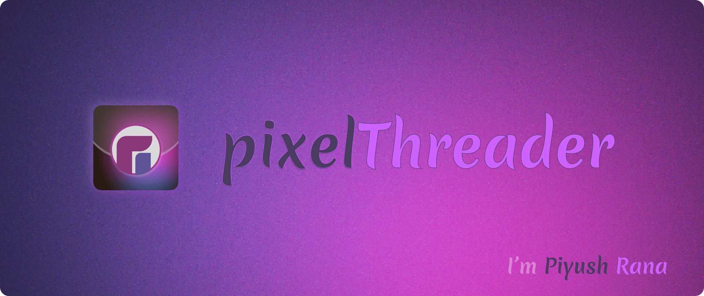

  

    

        🌟 Skilled full stack developer with a passion for <b>Modern web technologies</b>. Currently diving deep into <b>web API development</b>, with a focus on:
    

    
- <b style="color:green;">Git</b>: Proficient in version control.
- <b style="color:#5ce30b;">HTML</b>, <b style="color:#5ce30b;">CSS</b>, <b style="color:#5ce30b;">Tailwind CSS</b>, <b>SCSS</b>: Expertise in front-end development.
- <b style="color:#5ce30b;">JavaScript</b>, <b style="color:#5ce30b;">jQuery</b>: Strong skills in client-side scripting.
- <b style="color:#5ce30b;">Node.js</b>: Proficient in building scalable server-side applications.
- <b style="color:#5ce30b;">Python</b>, <b style="color:#5ce30b;">Django</b>: Experienced in backend development.
- <b style="color:#5ce30b;">PHP</b>, <b style="color:#5ce30b;">WordPress</b>: Familiarity with content management systems.
- <b style="color:#5ce30b;">Figma</b>: Proficient in UI/UX design.

🚀 <b>Open source</b> enthusiast. Continuously learning and engaging with the tech community.

## 🔗 Links

## SKILLSET

    

## Github Stats

    <code>Streak</code>

    

    <code>Stats</code>

    

    <code>Languages</code>

    

